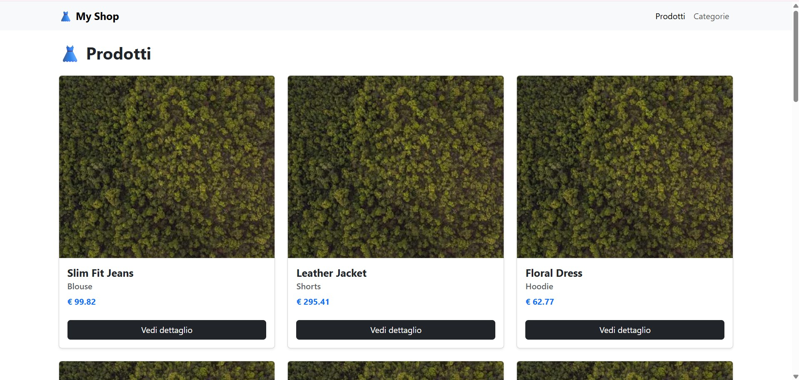
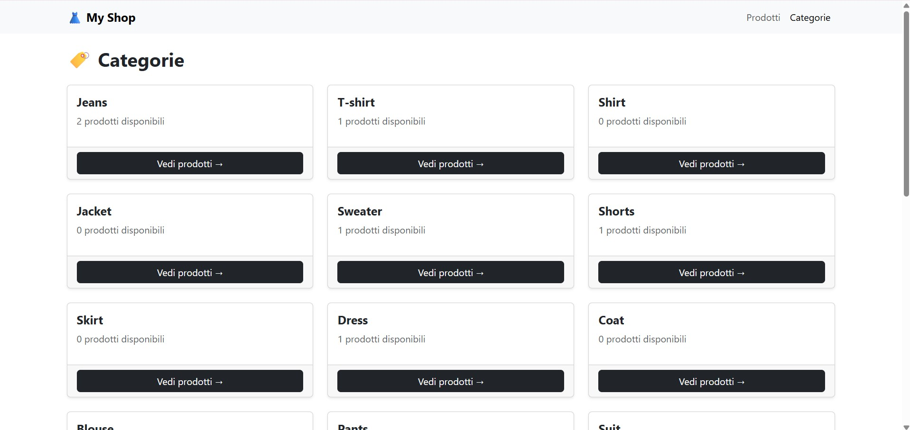

## ⚛️ React & Vite Frontend - E-commerce UI
Questa è l'interfaccia utente dinamica del mio progetto finale per il Master in Web Development di Boolean. Il frontend "consuma" i dati esposti dal backend Laravel per offrire un'esperienza di acquisto fluida e reattiva.

## 📸 Anteprima Progetto

## 🚀 Funzionalità Principali
- Catalogo Dinamico: Visualizzazione dei prodotti recuperati in tempo reale tramite API.
- Filtri Avanzati: Sistema di filtraggio per categoria per una ricerca rapida dei prodotti.
- Single Page Navigation: Navigazione fluida tra la home e le pagine di dettaglio prodotto grazie a React Router.
- Design Responsivo: Interfaccia responsive realizzata con Bootstrap.
- Integrazione API: Gestione delle chiamate asincrone tramite Axios.

## 🛠 Tech Stack
- React & Vite
- Bootstrap
- Chiamate Ajax con Axios

## ⚙️ Installazione Locale
Per avviare l'interfaccia sul tuo computer:
1. Clona il repo: git clone [https://github.com/Marianna-Dalterio/laravel-final-project-frontend--.git]
2. Entra nella cartella: cd [laravel-final-project-frontend--]
3. Installa le dipendenze: npm install
4. Configurazione API: Assicurati che il backend Laravel sia attivo (solitamente su http://localhost:8000). Se hai un file .env per l'URL dell'API, configuralo ora.
5. Avvia in modalità sviluppo: npm run dev

## 💡 Sfide Tecniche
In questa fase del progetto, mi sono concentrata sulla gestione dello stato di React e sull'ottimizzazione delle chiamate API con Axios. Gestire la sincronizzazione tra i filtri scelti dall'utente e i dati provenienti dal database Laravel è stato un ottimo esercizio per comprendere il flusso dei dati in un'applicazione professionale.

---

### 🔗 Repository Collegati
Per funzionare, questo frontend necessita del suo server backend:
- **Frontend (Questo Repo):** UI dinamica in React/Vite.
- **Backend:** API REST e Backoffice in Laravel. [Vai al Repository Backend →](https://github.com/Marianna-Dalterio/laravel-final-project.git)

---
